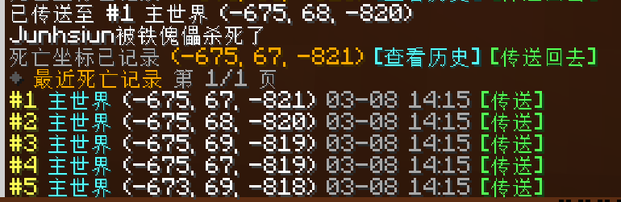

# Death Return

`Death Return` 是一个面向 Fabric 的死亡坐标记录模组，提供简洁、可追溯、可传送的死亡记录体验。

它会在玩家死亡时自动记录维度与坐标，并保留最近 `20` 次历史记录。玩家可以通过命令分页查看历史，或直接点击聊天消息中的按钮回到指定死亡点。模组同时支持原版维度和其他模组新增维度。



## 目录

- [功能概览](#功能概览)
- [兼容性](#兼容性)
- [安装方式](#安装方式)
- [使用方式](#使用方式)
- [命令说明](#命令说明)
- [配置说明](#配置说明)
- [数据存储](#数据存储)
- [开发与构建](#开发与构建)
- [版本发布](#版本发布)

## 功能概览

- 玩家死亡后自动记录当前位置，无需手动操作。
- 每位玩家保留最近 `20` 次死亡历史。
- `/deathpos` 以分页列表形式显示记录，每页 `5` 条。
- 每条记录都提供可点击的传送入口。
- 死亡后立即显示一条紧凑消息，包含当前位置、历史查看和回传按钮。
- 支持管理员查询其他玩家的死亡历史。
- 支持原版维度与模组新增维度的记录、显示和传送。
- 主要逻辑由服务端驱动，多人联机时客户端可选安装。

## 兼容性

| 项目 | 说明 |
| --- | --- |
| Minecraft | `1.21` 到 `1.21.11` |
| Fabric Loader | `0.16.0+` |
| Java | `21+` |
| Fabric API | 以当前工程锁定版本为准 |
| Fabric Language Kotlin | 必需 |

当前工程以 `Minecraft 1.21.11` 为主目标版本进行开发，使用的是 Fabric 官方开发链路和 Kotlin 语言支持。

## 安装方式

## 前置依赖

安装本模组前，请确保以下依赖已经同时安装到对应环境的 `mods` 目录中：

| 依赖 | 是否必需 | 说明 |
| --- | --- | --- |
| Fabric API | 必需 | 提供 Fabric 事件、命令和运行时 API |
| Fabric Language Kotlin | 必需 | 本模组使用 Kotlin 编写，缺失时无法加载 |

如果缺少 `fabric-language-kotlin`，游戏启动时会出现类似下面的报错：

```text
Mod 'Death Return' (death-return) ... requires fabric-language-kotlin, which is missing
```

因此，无论是客户端单人使用，还是服务端部署，都需要同时安装本模组及其依赖。

### 专用服务器

将模组放入服务器的 `mods` 目录后即可生效。  
客户端连接时不强制要求安装本模组。

### 客户端 / 单人游戏

本模组也可以直接安装在客户端，并在单人世界或局域网主机中正常工作。  
单人模式本质上运行的是内置服务器，因此本地安装后功能同样可用。

## 使用方式

玩家死亡后，模组会自动完成以下操作：

1. 记录本次死亡的维度、坐标和时间。
2. 将记录插入历史列表头部。
3. 仅保留最近 `20` 条数据。
4. 在聊天栏中发送一条简洁提示消息。

提示消息默认包含以下交互：

- `查看历史`：打开自己的死亡记录列表。
- `传送回去`：回到最近一次死亡点。

如果服务器管理员关闭了传送功能，传送入口将不会显示。

## 命令说明

### 玩家命令

| 命令 | 说明 |
| --- | --- |
| `/deathpos` | 查看自己的死亡历史第一页 |
| `/deathpos page <页码>` | 查看自己的指定页历史 |
| `/deathpos tp <编号>` | 传送到自己指定编号的死亡记录 |

### 管理员命令

| 命令 | 说明 |
| --- | --- |
| `/deathpos player <玩家>` | 查看目标玩家的死亡历史第一页 |
| `/deathpos player <玩家> page <页码>` | 查看目标玩家的指定页历史 |
| `/deathposadmin reload` | 重载配置文件 |
| `/deathposadmin set announceOnDeath <true\|false>` | 是否在死亡后发送提示消息 |
| `/deathposadmin set allowPlayersUseCommand <true\|false>` | 是否允许普通玩家使用 `/deathpos` |
| `/deathposadmin set adminsCanQueryOthers <true\|false>` | 是否允许管理员查询其他玩家记录 |
| `/deathposadmin set allowTeleport <true\|false>` | 是否允许玩家传送回死亡点 |

## 配置说明

配置文件路径：

```text
config/death-return.json
```

默认配置：

```json
{
  "announceOnDeath": true,
  "allowPlayersUseCommand": true,
  "adminsCanQueryOthers": true,
  "allowTeleport": true
}
```

配置项说明：

| 字段 | 默认值 | 说明 |
| --- | --- | --- |
| `announceOnDeath` | `true` | 玩家死亡后是否发送提示消息 |
| `allowPlayersUseCommand` | `true` | 普通玩家是否可以使用 `/deathpos` |
| `adminsCanQueryOthers` | `true` | 管理员是否可以查询其他玩家记录 |
| `allowTeleport` | `true` | 是否允许通过命令或按钮传送回死亡点 |

## 数据存储

死亡记录文件保存在世界存档目录中：

```text
<世界存档>/death-return/death-records.json
```

数据特点：

- 每位玩家保留最近 `20` 条记录。
- 新记录始终插入到列表顶部。
- 旧版本仅存储单条记录的数据会在读取时自动兼容。
- 维度统一保存为标准维度 ID，例如 `minecraft:overworld`、`ad_astra:moon`。

## 开发与构建

### 环境要求

- JDK `21`
- Gradle Wrapper

### 常用命令

构建：

```bash
./gradlew build
```

Windows:

```powershell
.\gradlew.bat build
```

仅编译 Kotlin：

```powershell
.\gradlew.bat compileKotlin
```

启动开发客户端：

```powershell
.\gradlew.bat runClient
```

启动开发服务端：

```powershell
.\gradlew.bat runServer
```

## 版本发布

项目当前采用基于 Git tag 的自动发布方式。

### 版本号

当前版本：

```text
1.1.2
```

版本号定义于：

```text
gradle.properties
```

### 发布流程

1. 修改 `gradle.properties` 中的 `mod_version`
2. 提交版本变更
3. 创建并推送 tag，例如：

```bash
git tag v1.1.2
git push origin v1.1.2
```

4. GitHub Actions 会自动执行以下操作：
   - 使用 JDK 21 构建项目
   - 生成 `build/libs/` 下的发布产物
   - 创建对应的 GitHub Release
   - 将构建出的 jar 文件附加到 Release

生成的 jar 文件名会自动包含以下信息：

- 模组版本
- Minecraft 版本
- Fabric Loader 版本
- Fabric API 版本

### 工作流说明

- `build.yml`
  - 用于常规提交和 Pull Request 构建验证
- `release.yml`
  - 仅在推送 `v*` 格式 tag 时触发自动发布

## 说明

本项目当前处于以实用性为主的开发状态，优先保证以下目标：

- 服务端行为稳定
- 聊天交互清晰
- 命令语义直接
- 配置项数量保持克制

如果需要扩展功能，建议继续沿用当前的设计原则：少配置、强反馈、低学习成本。
